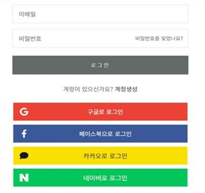
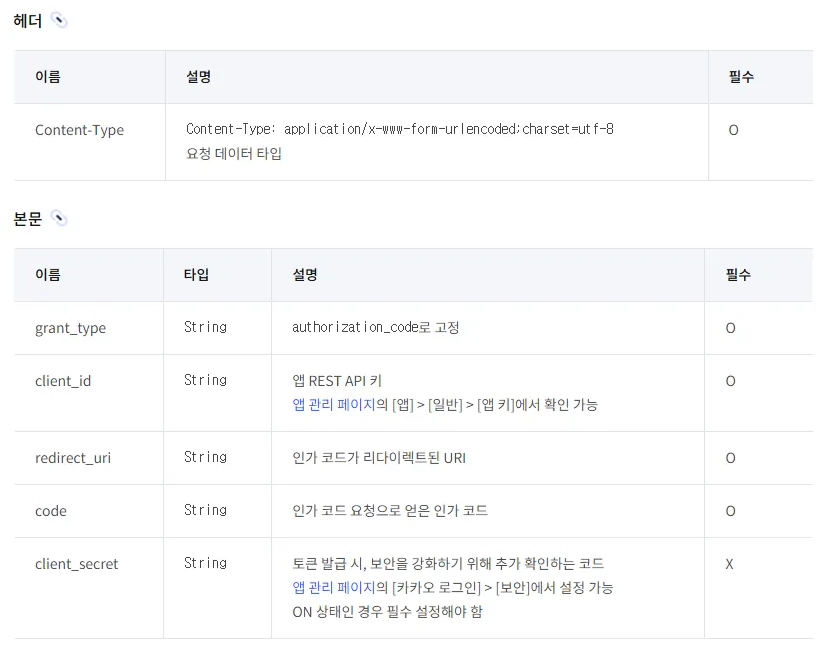

# OAuth 2.0

# 1. 인증 (Authentication)

- **인증이란?**
    
    인증(Authentication)은 시스템이나 서비스가 사용자의 신원을 확인하는 과정입니다. 이를 통해 사용자
    의 신원을 식별하고 무분별한 접근을 차단함으로써 데이터 유출을 방지할 수 있습니다. 그러므로 인증은 보안의 핵심 요소로서 웹 서비스 개발 및 설계 시 중요한 고려사항입니다.
    
- **인증 방식**
    
    1. 비밀번호 기반 인증
    
    2. 2단계 인증 (Two Factor Authentication, 2FA)
    
    3. 생체 인증
    
    4. 토큰 기반 인증
    
    5. 인증서 기반 인증
    
    6. 외부 OAuth 인증 (구글, 네이버, 카카오 등)
    

# 2. 인가 (Authorization)

- **인가란?**
    
    인가(Authorization)란 인증된 사용자가 특정 리소스나 서비스에 대해 어떤 권한을 가지고 접근하거나 행동할 수 있는지를 결정하는 과정입니다. 이 과정을 통해 사용자마다 사용할 수 있는 메뉴나 권한이 결정됩니다. 인가는 인증과 더불어 보안의 핵심 요소입니다.
    
- **권한 부여 방식**
    1. RBAC (역할 기반 접근 제어)
    2. ABAC (속성 기반 접근 제어)
    3. PBAC (정책 기반 접근 제어)

# 3. 인증 vs 인가

- **인증과 인가의 차이 비교**
    
    
    | **구분** | **인증(Authentication)** | **인가(Authorization)** |
    | --- | --- | --- |
    | 목적 | 신원 확인 | 권한 확인 및 부여 |
    | 요청 시점 | 서비스 진입(로그인 전) | 서비스 내부 기능 이용 시 |
    | 예시 | 로그인, OTP, 생체인식 | 관리자 페이지, 데이터 수정 권한 |
    | 사용자가 볼 수 있음 | 있음 | 없음 |
    | 데이터 전송 방식 | ID 토큰 | 액세스 토큰 |

# 4. OAuth (Open Authorization)

- **OAuth란?**
    
    OAuth는 웹, 모바일 및 데스크톱 애플리케이션에서 널리 사용되는 개방형 표준 권한부여 프로토콜
    (RFC 6749)입니다. 사용자의 인증(개인) 정보를 직접 공유하지 않고도 서비스 간에 안전한 인증과 권한
    위임을 가능하게 합니다. 사용자의 로그인(인증, 개인) 정보를 직접 공유하지 않고도 제3자 애플리케이션
    이 다른 서비스의 사용자 데이터에 접근할 수 있도록 허용하는 개방형 표준 권한 부여 프로토콜을 의미합니다.
    
    구글, 카카오, 네이버 등 소셜 로그인을 통해 사용자 계정 정보를 노출하지 않고도 서비스 간 연동이 가
    능해지며, 주로 액세스 토큰을 발급받아 권한을 위임하게 됩니다.
    
    소셜 로그인은 Facebook, Google, Naver, GitHub 등의 소셜 네트워킹 서비스 계정
    정보를 활용하여 다른 애플리케이션이나 플랫폼에 간편하게 로그인하거나 회원가입 할 수 있는 인증 방
    식입니다. 소셜 로그인 기능의 핵심 기반 기술이 바로 OAuth입니다.
    
    
    

### 4.1 OAuth 1.0

- **동작 방식**
    
    
    
    ① 사용자는 애플리케이션(소비자)을 사용하려고 접근합니다.
    
    ② 애플리케이션은 서비스 제공자에게 접근 권한을 요청하기 위해 사용자를 소셜 네트워킹 페이지로 이동시킵니다.
    
    ③ 사용자는 본인 인증을 수행하고, 애플리케이션이 서비스 제공자로부터 정보를 제공 받는 것을 승인합니다.
    
    ④ 서비스 제공자는 애플리케이션에게 접근 권한을 부여하고, 애플리케이션은 이를 통해 사용자 정보에 접근할 수 있게 됩니다.
    
- **역할**
    
    OAuth 1.0에서는 역할에 따라 사용자(User), 소비자(Consumer), 그리고 서비스 제공자(Service Provider)로 구분 지으며 각각 다음 역할이 부여됩니다.
    
    
    
- **OAuth 1.0의 한계**
    1. OAuth 1.0은 모든 요청에 대해 암호화된 서명을 생성하고 검증하는 방식을 사용했습니다. 이는 보안성을 강화하는 수단이기도 했지만, 각 요청마다 복잡한 서명 과정을 필요로 하여 서버 측에서 검증 로직을 구현하는데 어려움이 따랐습니다.
    2. OAuth 1.0의 제한된 인증 방식으로 인해 모바일 애플리케이션과 같은 다양한 환경에서 사용하기 어려웠고, 이로 인해 다른 플랫폼에서의 적용이 쉽지 않아 확장성이 부족했습니다.
    3. OAuth 1.0은 인증 토큰(Access Token) 유효기간에 대한 명확한 스펙이 없어 재사용 가능성이라는 보안 위험이 잔존했고, 토큰을 무효화하려면 서비스 제공자의 애플리케이션에서 비밀번호를 직접 변경해야 했습니다.
- **OAuth 2.0 출현**
    
    OAuth 1.0이 가지고 있는 문제점을 개선하고 더 다양한 인증 방식과 간편한 토큰 관리 그리고 세밀한 권한 제어를 제공하기 위해 OAuth 2.0 표준이 개발되었습니다.
    

### 4.2 OAuth 2.0

- **동작 방식**
    
    
    
    ① 사용자인 Resource Owner는 소셜 로그인을 통해 클라이언트가 제공하는 서비스에 접근하고자 하며, 이를 위한 권한 위임을 요청합니다.
    
    ② 클라이언트(Client)는 Authorization Server에게 Resource Server가 보호하는 자원에 접근하기 위한 Access Token 발급을 요청합니다. 이 때, 사용자는 인증(로그인)을 위해 Authorization Server의 페이지로 이동합니다.
    
    ③ 사용자는 클라이언트에 대한 권한 위임을 승인합니다.
    
    ④ Authorization Server는 클라이언트에게 Access Token을 발급합니다. 이 Access Token에는 만료기간이 설정되어 있습니다.
    
    ⑤ 클라이언트는 Resource Server에게 Access Token을 전달하면서, 사용자의 정보를 요청합니다.
    
    ⑥ Resource Server는 Access Token의 유효성을 확인하기 위해 이를 발급한 Authorization Server에 검증을 요청합니다.
    
    ⑦ Authorization Server가 Access Token의 유효성을 확인하면, Resource Server에게 인증 성공 메시지를 전송합니다.
    
    ⑧ Resource Server는 클라이언트가 요청한 사용자 정보를 반환합니다.
    
- **역할**
    
    OAuth 2.0 표준에서는 역할에 따라 Client, Resource Owner, Resource Server 그리고 Authorization Server로 구분 지었습니다.
    
    
    
- **OAuth 2.0의 특징**
    
    OAuth 2.0은 1.0 버전과 비교하여 여러 측면에서 크게 개선되었습니다. 가장 주목할 만한 변화는 서버 구조의 분리입니다. OAuth 1.0에서는 인증, 권한 부여, 자원 제공이 단일 서버에서 통합 처리되었으나, 2.0에
    서는 이를 인증 및 권한 부여 서버(Authorization Server)와 자원 서버(Resource Server)로 분리하여 시스템의 유연성과 확장성을 높였습니다. 
    
    OAuth 2.0은 Access Token의 유효 기간에 대한 명확한 기술 명세를 제시하여 토큰 재사용과 관련된 보안 취약점을 개선했습니다. 또한, HTTPS 프로토콜을 통한 암호화를 도입함으로써 OAuth 1.0에서 요구되던 복잡한 서명 과정을 제거했습니다. 이로 인해 기능 구현이 간소화되었고, 다양한 인증 수단을 지원하게
    되어 범용성이 향상되었습니다.
    

# 5. 카카오 로그인

### **5.1 카카오 로그인 훑어보기 (출처 : kakao developers [문서] > [카카오 로그인])**

- **5.1.1 카카오 로그인 과정 개념**

- **5.1.2 개발 환경별 카카오 로그인 API (REST API 방식 활용)**

- **5.1.3 토큰**

<aside>
💡

토큰은 사용자의 인증과 권한 정보를 담은 문자열입니다. 서비스는 [인가](https://developers.kakao.com/docs/latest/ko/kakaologin/common#login-authorization) 결과로 발급받은 인가 코드로 토큰 발급을 요청할 수 있고, 발급받은 토큰을 API 요청에 포함해서 정보 수신 또는 기능 사용 권한이 있음을 증명할 수 있습니다.

</aside>

<aside>
💡

카카오 로그인은 OAuth 2.0 표준 규격에 따라 액세스 토큰(Access token), 리프레시 토큰(Refresh token) 두 종류의 토큰을 발급합니다. [OpenID Connect](https://developers.kakao.com/docs/latest/ko/kakaologin/utilize#oidc)를 활성화하면 ID 토큰을 추가로 발급받을 수 있습니다.

</aside>

- **5.1.4 카카오 로그인 과정**

<aside>
💡

REST API 방식의 카카오 로그인은 PC 및 모바일 웹에서 사용하기 적합한 방식입니다.

</aside>

**1. 인가 코드 요청**

1. 서비스 서버가 카카오 인증 서버로 [인가 코드 요청](https://developers.kakao.com/docs/latest/ko/kakaologin/rest-api#request-code)을 호출합니다.
2. 카카오 인증 서버가 사용자에게 [인증](https://developers.kakao.com/docs/latest/ko/kakaologin/common#login-authentication)을 요청합니다.
    - 사용자 클라이언트에 유효한 카카오계정 세션이 있거나, 카카오톡 인앱 브라우저에서의 요청인 경우 4단계로 넘어갑니다.
3. 사용자가 카카오계정으로 로그인합니다.
4. 카카오 인증 서버가 사용자에게 동의 화면을 출력하여 [인가](https://developers.kakao.com/docs/latest/ko/kakaologin/common#login-authorization)를 위한 사용자 동의를 요청합니다.
    - 동의 화면은 서비스 앱의 [동의항목 설정](https://developers.kakao.com/docs/latest/ko/kakaologin/prerequisite#scope)으로 구성됩니다.
5. 사용자가 필수 동의항목과, 이 외의 원하는 동의항목에 동의한 뒤 [동의하고 계속하기] 버튼을 누릅니다.
6. 카카오 인증 서버는 서비스 서버의 리다이렉트 URI로 인가 코드를 전달합니다.

**2. 토큰 요청**

1. 서비스 서버가 리다이렉트 URI로 전달받은 인가 코드로 [토큰 요청](https://developers.kakao.com/docs/latest/ko/kakaologin/rest-api#request-token)을 호출합니다.
2. 카카오 인증 서버가 토큰을 발급해 서비스 서버에 전달합니다.

**3. 사용자 로그인 처리**

1. 서비스 서버가 발급받은 액세스 토큰으로 [사용자 정보 조회](https://developers.kakao.com/docs/latest/ko/kakaologin/rest-api#req-user-info)를 요청해 사용자의 회원번호 및 정보를 조회하여 서비스 회원인지 확인합니다.
2. 서비스 회원 정보 확인 결과에 따라 서비스 로그인 또는 회원 가입합니다.
3. 이 외 서비스에서 필요한 로그인 절차를 수행한 후, 카카오 로그인한 사용자의 서비스 로그인 처리를 완료합니다.

### 5.2 카카오 로그인 구현을 위한 정보 확인

**5.2.1 인가 코드 요청**

**5.2.1 토큰 요청**

**5.2.3 요청**

### 5.3 카카오 로그인 설정 과정

**5.3.1 앱 만들기**

**5.3.2 앱 설정**

**5.3.3 동의항목**

**5.3.4 앱 키**

# 6. 네이버 로그인

**6.1 네이버 개발자센터 (**[https://developers.naver.com/main/](https://developers.naver.com/main/))

**6.2 네이버 로그인 - 오픈 API 이용 신청**

**6.3 애플리케이션 등록**

**6.4 등록 결과 확인 (Client ID와 Client Secret을 기억해 둘 것)**

